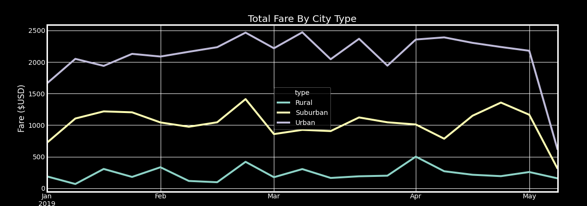
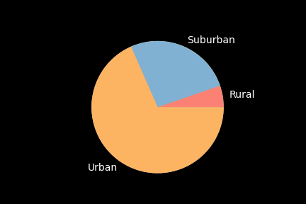
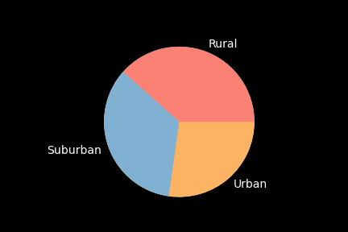

# **PyBer_Analysis**

## **Purpose**
The purpose of this analysis is to visualise the total weekly fares for each city type using Python and Pandas, and Matplotlib library.

## **Results**

From the graph depicted below, we can conclude that fares were lowest in the rural areas followed by the Suburban and the highest rate was in the urban areas.

Below is the breakdown of the total rides based on the city type:
- Rural        125
- Suburban     625
- Urban       1625

As predicted, the Urban area has the highest total rides, followed by the suburban and rural areas. This is directly proportional to the population of the city types. The same pattern was followed with the total number of drivers as well. The metrics for the Total number of Drivers based on the city type as below:

- Rural         78
- Suburban     490
- Urban       2405

We can also notice the inverse correlation between the number of total rides and the average fare per ride. The higher the number of rides in the city type, the lower the average fare per ride. This can be directly related to the supply and demand factor.

- Rural       $34.623440
- Suburban    $30.970128
- Urban       $24.525772

The same pattern was observed with the average fare per driver as illustrated below:
- Rural       $55.486282
- Suburban    $39.502714
- Urban       $16.571468

Although the total fare was obviously highest in the urban areas, followed by suburban and rural areas as shown below:
- Rural        $4327.93
- Suburban    $19356.33
- Urban       $39854.38

## **Summary**

Based on the analysis, the following recommendation can be made to make informed business decisions:

- The rides were lower during Jan and Feb because of the winter. This can be tackled by offering special rates during those months.
- Urban areas are clearly more profitable, and more funds can be allocated in that area.
- More strategies are required to attract more drivers in the rural areas and decreases the average cost per driver.

